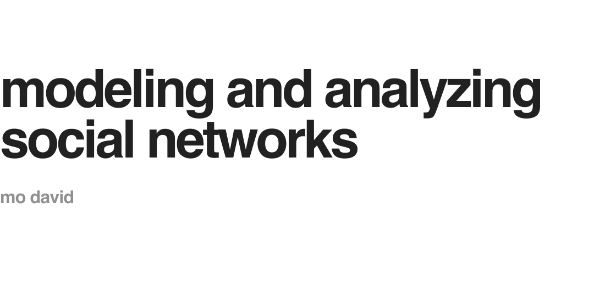

This project aims to provide tools that enable us to analyze the structure of social networks. Any dataset containing adjacency information across nodes may be used, and nodes may be indexed using any schema (although the original project specifications limited node ids to integer values, any string without whitespaces are accepted by the program). 

The initial plan for the project involved using Java for the code base; however, after attempting to read the larger datasets using the core functionalities enabled by the default Java SDK, it was decided that IO operations could be done much more efficiently in C. Although Java provided more language tools that would enable implementing the project with much less hassle, Java was considerably slower at reading the input files (although in hindsight there are actually faster Java-based ways to load the files into memory by using streams or blobs). The author wanted to be able to model larger datasets.

Additionally, there was also a plan to visualize the datasets using force-directed graphs; however, due to the size of the datasets, the usual naive approach of modeling these datasets would take a considerable amount of runtime (the naive algorithm exhibits $\mathcal{O}(n^3)$; $n$ iterations with $n^2$ computations of force across each pair of vertices). Following this, the Barnes-Hut algorithm became a possible option for modeling these datasets in a more realistic timeframe. But due to the span of the remaining project timeline, the schedule was insufficient to allow integrating this algorithm into the project. The author notes this in the recommendations section.

An important thing to note: object-oriented programming is not idiomatic in C (much less the idea of a "class"). C structs can only do so much to emulate classes, and binding methods to these structs does nothing but convolute code. Nevertheless, we refer to some of the constructs here as "classes" and some of their associated functions as "methods". For the purposes of this discussion, the code behaves (more or less) similarly to their "pure" counterparts in Java.

### 1.1 Using the Program

To compile the program, simply call 

```
gcc ./source/main.c -o ./source/main
```

then run using

```
./main
```

On Windows, the commands would look slightly different (because instead of `/`, cmd parses `\`), but the overall process is the same. The program then loads the default dataset from the data folder (which the author has set to `Caltech36.txt`). Once the data has been loaded, the user is greeted by the interface shown here. We discuss each of the options below.

```

    Modeling and Analyzing Networks
    """""""""""""""""""""""""""""""
    [] Loaded: ./data/Caltech36.txt
    _______________________________

[]  Select what to do next.

[|  1.  Load another dataset.
[|  2.  Display friend list.
[|  3.  Display connections.
[|  0.  Exit the app.

```

> <b style="color: rgba(255, 155, 55, 1); background-color: rgba(255, 155, 55, 0.16); padding: 4px 8px;">1. Load another dataset.</b>
>
> This allows the user to load another file to replace the currently active dataset within the program. For larger files, the program may take a few seconds to load the data, although nothing more than 10 seconds should be expected (per the tests conducted by the author on the provided datasets). Only text files are accepted by the program, and data must be encoded according to the format specified in the subsection: ***1.2 Input Formats***. The prompt is displayed below as a reference.
>
> ```
>
>    Modeling and Analyzing Networks
>    """""""""""""""""""""""""""""""
>    [] Loaded: ./data/Caltech36.txt
>    _______________________________
>
>[]  Specify a dataset to load.
>
>[>  
>
>```
>
> <b style="color: rgba(55, 55, 255, 1);">As an example</b>, try inputting `./data/Harvard1.txt` into the program for this option. The program should load the requested data and bring the user back to the menu.

> <b style="color: rgba(255, 155, 55, 1); background-color: rgba(255, 155, 55, 0.16); padding: 4px 8px;">2. Display friend list.</b>
>
> This option allows the user to view the particular nodes that are adjacent to a given node. The program requires the node id from the user, and displays the ids of the adjacent nodes in a series of columns (in no particular order). Because all the ids of the starter datasets are integers, inputting any of these integers will also produce a list of integer-ids.
>
> <b style="color: rgba(55, 55, 255, 1);">As an example</b>, we have inputted the id `123` into the program with the `Caltech36.txt` dataset marked active. 11 "friends" were found and listed. The user has the option to inspect another node by pressing `y` or `Y`.
>
> ```
>
>    Modeling and Analyzing Networks
>    """""""""""""""""""""""""""""""
>    [] Loaded: ./data/Caltech36.txt
>    _______________________________
>
>[]  You are now viewing the friend count for a given node.
>[]  Specify a node to inspect.
>
>[>  123
>
>	Friends (11): 
>
>	 20, 106, 302, 332, 354, 434, 469,	
>	521, 572, 734, 757,	
>
>[]  Inspect another node? (y/n)
>
>[>  
>
>```

> <b style="color: rgba(255, 155, 55, 1); background-color: rgba(255, 155, 55, 0.16); padding: 4px 8px;">3. Display connections.</b>
>
> The last program action allows the user to check whether or not a "connection" exists between two nodes in the network. A connection between two nodes just refers to a chain of friends that *connect* the two nodes. The program requires two node ids from the user, after which the connection id displayed, following the order the nodes were displayed (in other words, the first node is written first and the second node is written last).
>
> <b style="color: rgba(55, 55, 255, 1);">As an example</b>, we have selected to view a connection between `123` and `321` within the `Caltech36.txt` dataset. The program has indicated that `123 => 20 => 63 => 321` is a valid connection. We can verify this by going back to the **2. Display friend list.** option (and if we do this, we indeed find that the connection is valid).
>
> ```
>
>    Modeling and Analyzing Networks
>    """""""""""""""""""""""""""""""
>    [] Loaded: ./data/Caltech36.txt
>    _______________________________
>
>[]  You are now viewing connections between two nodes.
>[]  Specify a node 1.
>
>[>  123
>
>[]  Specify a node 2.
>
>[>  321
>
>	The following path was found.
>
>
>	=> 123	=> 20	=> 63	=> 321	
>
>[]  View another connection? (y/n)
>
>[>  
>
>```

Note that for all of the functionalities discussed above, invalid id inputs are handled accordingly (the program alerts the user that one of the node ids were invalid and that they should retry inputting this). The final option `0. Exit the app.` will no longer be discussed in detail as it should be rather straightforward.

### 1.2 Input Formats

The program accepts any text file that enumerates adjacency information as a list of pairs of ids. The text file must contain a first line that specifies the number of nodes and the number of connections, with the two being separated by at least one whitespace. Overall, the file should look like:

```text
number_of_nodes number_of_connections
id_0 id_1
id_0 id_3
.
.
.
id_0 id_n
id_1 id_2
id_1 id_5
id_1 id_10
.
.
.
id_m id_n
```

Here, every pair of ids represents a bidirectional connection. The sample data provided for the project enumerated connections twice (for instance, both `id_0 id_1` and `id_1 id_0` would be transcribed), but such encoding is unnecessary since the data is stored in an undirected graph. For that reason, the program will gladly accept files that do not repeat connection information in this way. 

Lastly, although the original project specifications were restricted to using integer-based ids, we reiterate that the program can accept any whitespace-free string to refer to ids. After all, the adjacency data and the nodes are stored via hashmaps (to be explained more below).


### 2.1 Entry

To store data within our hashmaps and queues, we will be using an `Entry` class to represent the individual elements within these constructs. The `Entry` class stores references to adjacent `Entry` instances: this is useful because both our hashmaps and queues utilize linked lists to implement their functionalities. The `Entry` class only acts as a wrapper around our data and should not be thought of as representing the data itself; it only houses a *pointer* to the actual data we're keeping in memory. By doing that, we have a separation of concerns and can prevent our data structures from becoming coupled to the data we want to model.

### 2.2 Hash Map

Java has a readily-available implementation of the hashmap that comes part of the language. C, on the other hand, does not offer any form of functionality that comes close to resembling hashmaps. In order to leverage the benefits of using this data structure to index our nodes, manual implementations of hashing and memory allocation were necessary. Our `HashMap` class defines those procedures for us.

For the hashing function, [murmur hash](https://en.wikipedia.org/wiki/MurmurHash) was chosen as a reasonable algorithm. It presented the perfect balance between complexity and speed for the purposes of the project: the implementation was straightforward enough to construct using C primitives, and the intricacy of the algorithm ensured minimal collisions over a large enough array. Murmur hash also reads its inputs in sequences of four bytes so that each group can be treated as a single unsigned integer; it then performs a series of multiplications (MU) and rotations (R), which lend it the name murmur hash. In the case of this project, the id of the nodes are used to generate the hashes associated with them. Since we are dealing with strings, each group of four adjacent characters are manipulated by the algorithm and the results are accumulated to produce the eventual hash.

The hash function is only half the story. When implementing hashmaps, collisions are unavoidable, especially for smaller arrays. To deal with these, a linked list can be generated whenever a collision occurs (the linked list is handled by the `Entry` class mentioned above). Of course, given enough insertions, the linked lists within the hashmap will eventually become too long and can penalize the behavior of the data structure. To remedy this, our `HashMap` class automatically detects when it must perform resizes: this occurs when the average length of the linked lists exceeds a certain value (for our program, $1.1$), or when the number of filled slots within the array have exceeded a certain threshold ($> 50\%$ of the slots have been filled).

### 2.3 Queue

The queue is a simpler data structure. To create the `Queue` class, we only need a pointer to the head and tail `Entry` instances. The tail allows us to `queue()` new entries, while the head allows us to `dequeue()` the entries that have been waiting the longest. The only time we use a queue is when looking for connections between nodes within the dataset. During this procedure, a breadth-first search is conducted. A queue holds the nodes that need to be visited.

### 2.4 Stack

Stacks, like queues, are trivial to implement. The only difference here is that we only need to store a head pointer (no need for a tail pointer since we `push()` and `pop()` `Entry` instances onto the head). Stacks are also only used when looking for connections within our dataset. Because the sequence of nodes produced by our breadth-first search implementation reads the connection in reverse, we use a stack to allow us to print the connection in the right order (from the source node to the target node, instead of vise versa).


To decouple the model from the components we have, the author created separate classes to represent specific parts of the model defined by the project (social networks). Think of the structures outlined in ***2. Components*** as constructs we defined as an extension of the C language, rather than as specific parts of this project. Thus, it makes sense to develop those parts independent of the actual data we want to represent. On the other hand, all the classes outlined in ***3. Model Representation*** have methods and properties that behave *according to the project specifications*.

### 3.1 Record

To represent the data stored by individual nodes within the network, the `Record` class was created. Given the nature of the provided starter data, `Record` instances were design to hold only names and ids (for the purposes of this project, the names and ids are simply equal). If we wanted to extend the functionality of our program, we could just as well add other properties to the record class (such as user address, user SSN, etc.). The core behavior of the program would not be affected.

### 3.2 Node

The `Node` class could just as well been placed within ***2. Components***. Nevertheless, it is placed here because the author believes there was not enough of a *generalization* to separate the `Node` class from depending on the model data (in this case, it always assumes connections are bidirectional).

To store adjacency information, each `Node` instance has its own `HashMap` instance that stores pointers to adjacent nodes indexed by their id. This is very useful as it allows us to determine adjacencies in $\mathcal{O}(1)$ time.

By doing this, the `Node` class allows us to model the graph of our social networks. Of course, simply constructing the connections between the nodes and storing a "2d linked list" of sorts would be cumbersome to deal with: traversing the graph would take a while, and accessing information on any node would require us to start at the "head" of the graph (this is akin to how we start at the head of a queue, and since these graphs aren't necessarily trees, calling them "roots" would be incorrect). So how do we deal with this? The `Model` class outlined below details our solution.

### 3.3 Model

To speed up the access of any given node, the model also stores a `HashMap` that indexes all nodes by their id. That way, any node is accessible in $\mathcal{O}(1)$ time. The `Model` class performs all the graph-related logic and operates on the nodes themselves. When we wish to query the friends of a given node, the `Model` class does this for us. When we wish to find a connection between two given nodes, the `Model` class also does this for us.

Ideally, the model class should only deal with the data itself and should not handle any side effects such as printing to the console. However, due to time constraints, a few of the printing functions were delegated to this class. Nevertheless, the author resolved to isolate the printing processes as much as possible from the core functionalities of the `Model` class. 

# 4 Reflections, Recommendations

### 4.1 Visualizing the Different Social Networks

Midway the project, there was a plan to visualize the datasets using [force-directed graphs](https://en.wikipedia.org/wiki/Force-directed_graph_drawing). As much as the author tried, this seemed to be the only possible solution to constructing an *orderly* network graph. Although naive implementations of this method have an $\mathcal{O}(n^3)$ time complexity, [the Barnes-Hut algorithm](https://en.wikipedia.org/wiki/Force-directed_graph_drawing) provided an alternative solution with $\mathcal{O}(n^2 \log n)$ time. This solution was attempted (and almost included) in the final submission, but time constraints forbade this from happening. Nevertheless, the author will duly update this repository (even after the submission deadline) if he manages to implement the said functionalities. As of now, it will be left here as a recommendation for others who might want to do this.

### 4.2 Java Might've Been Better After All (...or Not?)

Rather than a recommendation: I find it interesting to think about how differently this project would have gone had I decided to stick to Java. In hindsight, there probably exists a faster way to read text files aside from parsing each token one after the other (which is what took so long with Java). If I figured this out early on, I might've had an easier time constructing the `Model` class (as I wouldn't have needed to implement hashmaps, queues, and stacks from the ground up). I could've had more time to visualize the datasets. Alas, it is too late to change this.

Anyway, I do feel grateful having meddled with the implementations of those data structures; it taught me a lot having to build them with nothing but the barest of C tools (although I would like to say that it's not my first time doing this--I had a bit of fun doing that last term!)

# 5 Author


---

```
                                                    |\      _,,,---,,_
                                             ZZZzz /,`.-'`'    -.  ;-;;,_
                                                  |,4-  ) )-,_. ,\ (  `'-'
                                                 '---''(_/--'  `-'\_)
```
[neue-dev](https://github.com/neue-dev)

<br />

### 4.1 Author's Acknowledgements

