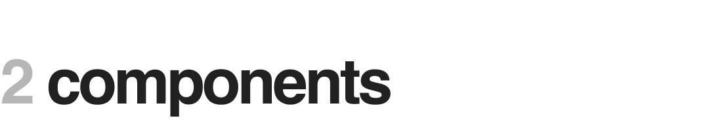

This project aims to provide tools that enable us to analyze the structure of social networks. Any dataset containing adjacency information across nodes may be used, and nodes may be indexed using any schema (although the original project specifications limited node ids to integer values, any string without whitespaces are accepted by the program). 

The initial plan for the project involved using Java for the code base; however, after attempting to read the larger datasets using the core functionalities enabled by the default Java SDK, it was decided that IO operations could be done much more efficiently in C. Although Java provided more language tools that would enable implementing the project with much less hassle, Java was considerably slower at reading the input files (although in hindsight there are actually faster Java-based ways to load the files into memory by using streams or blobs). The author wanted to be able to model larger datasets.

Additionally, there was also a plan to visualize the datasets using force-directed graphs; however, due to the size of the datasets, the usual naive approach of modeling these datasets would take a considerable amount of runtime (the naive algorithm exhibits $\mathcal{O}(n^3)$; $n$ iterations with $n^2$ computations of force across each pair of vertices). Following this, the Barnes-Hut algorithm became a possible option for modeling these datasets in a more realistic timeframe. But due to the span of the remaining project timeline, the schedule was insufficient to allow integrating this algorithm into the project. The author notes this in the recommendations section.

An important thing to note: object-oriented programming is not idiomatic in C (much less the idea of a "class"). C structs can only do so much to emulate classes, and binding methods to these structs does nothing but convolute code. Nevertheless, we refer to some of the constructs here as "classes" and some of their associated functions as "methods". For the purposes of this discussion, the code behaves (more or less) similarly to their "pure" counterparts in Java.

### 1.1 Input Formats

The program accepts any text file that enumerates adjacency information as a list of pairs of ids. The text file must contain a first line that specifies the number of nodes and the number of connections, with the two being separated by at least one whitespace. Overall, the file should look like:

```text
number_of_nodes number_of_connections
id_0 id_1
id_0 id_3
.
.
.
id_0 id_n
id_1 id_2
id_1 id_5
id_1 id_10
.
.
.
id_m id_n
```

Here, every pair of ids represents a bidirectional connection. The sample data provided for the project enumerated connections twice (for instance, both `id_0 id_1` and `id_1 id_0` would be transcribed), but such encoding is unnecessary since the data is stored in an undirected graph. For that reason, the program will gladly accept files that do not repeat connection information in this way. 

Lastly, although the original project specifications were restricted to using integer-based ids, we reiterate that the program can accept any whitespace-free string to refer to ids. After all, the adjacency data and the nodes are stored via hashmaps (to be explained more below).



### 2.1 Hash Map

### 2.2 Queue

### 2.3 Stack


### 3.1 Record

this represents the actual data we store in the graph
in this case, given the nature of the data, a record only contains an id and a name (which we just make equal for the purposes of this program)

we never actually needed to access the records for the purposes of this program, but that's okay; in case we want to extend our program to store much more complicated data, we could do so by changing this struct. the behaviour of the program will still be the same, and graphs can still be modeled.

### 3.2 Node

these are just pointers; the actual data are stored in the records
all the nodes do are help us create relationships among the records; so by swapping the records out, we can store somthing else
it's proper encapsulation!

### 3.3 Model

The model performs all the graph-related logic and operates on the nodes.
This is where traversing the graph, adding /removing nodes, etc. are done. 
I tried my best to separate out the printing functions as much as i could.

> Constructing the representation from the data structures
>

# 4 Reflections, Recommendations

# 5 Author


---

```
                                                    |\      _,,,---,,_
                                             ZZZzz /,`.-'`'    -.  ;-;;,_
                                                  |,4-  ) )-,_. ,\ (  `'-'
                                                 '---''(_/--'  `-'\_)
```
[neue-dev](https://github.com/neue-dev)

<br />

### 4.1 Author's Acknowledgements

